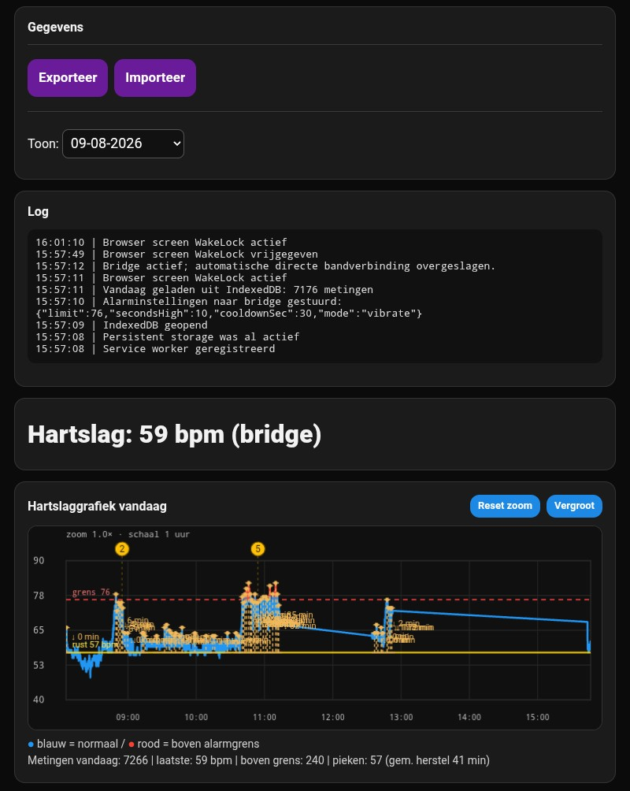
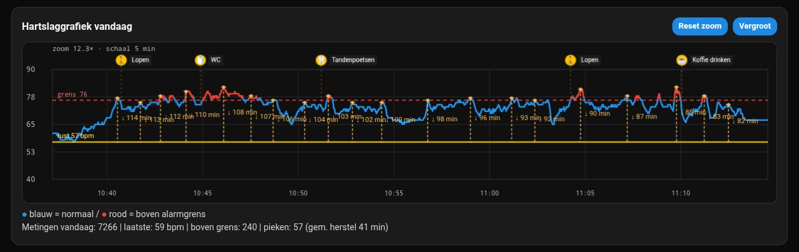
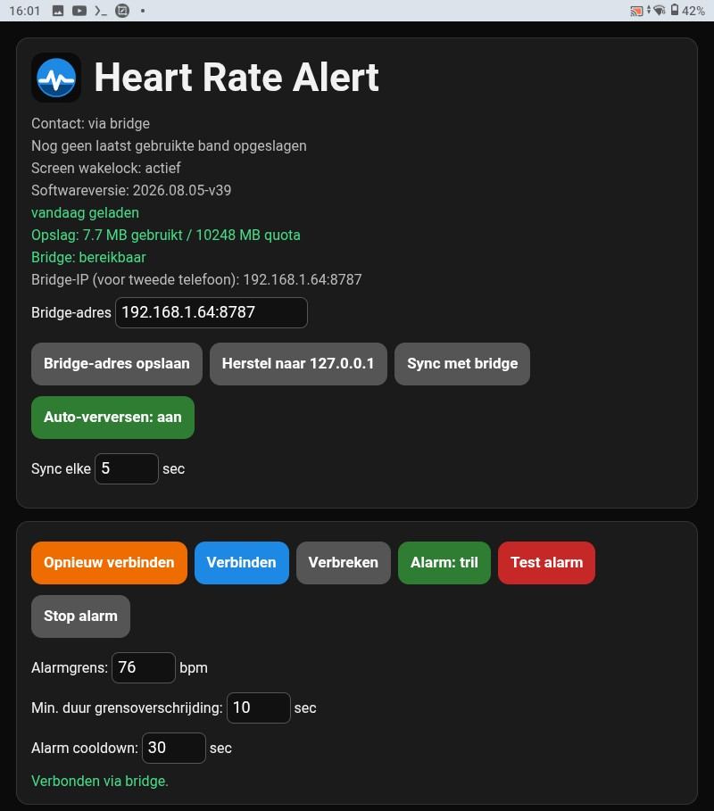
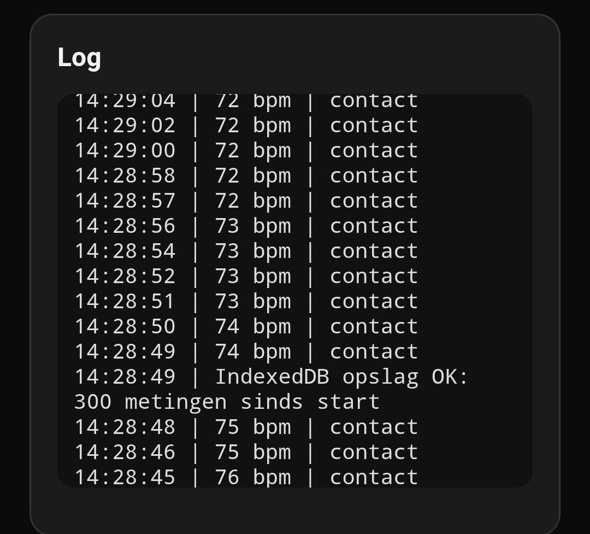
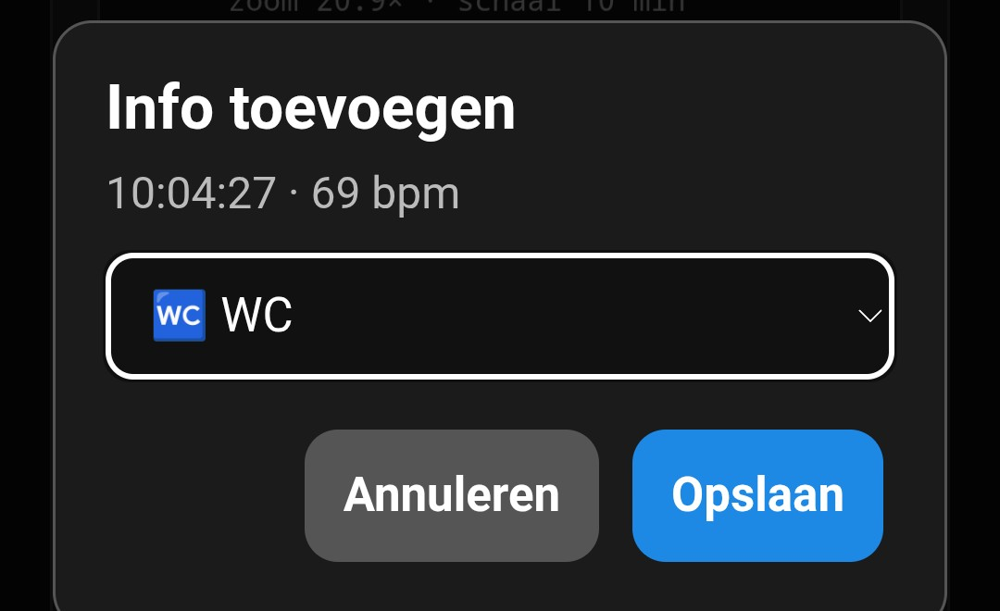
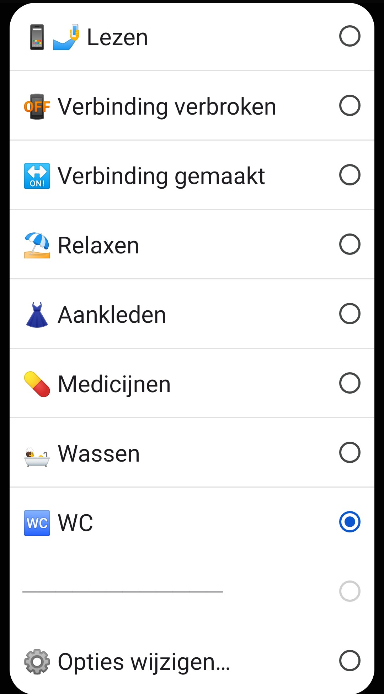
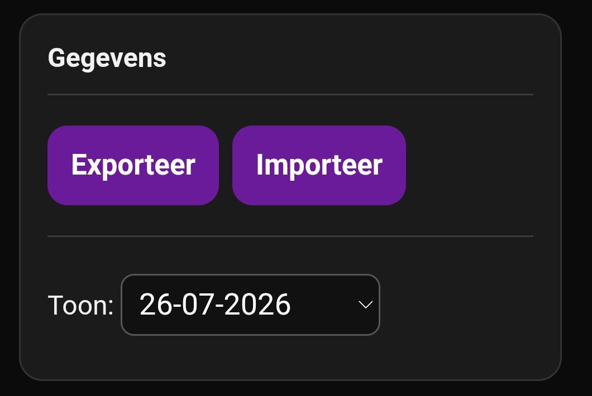
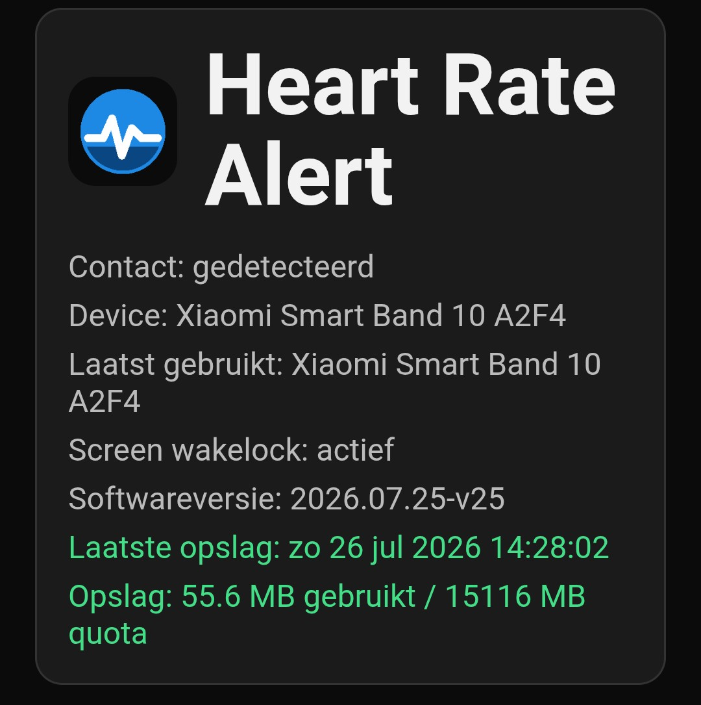
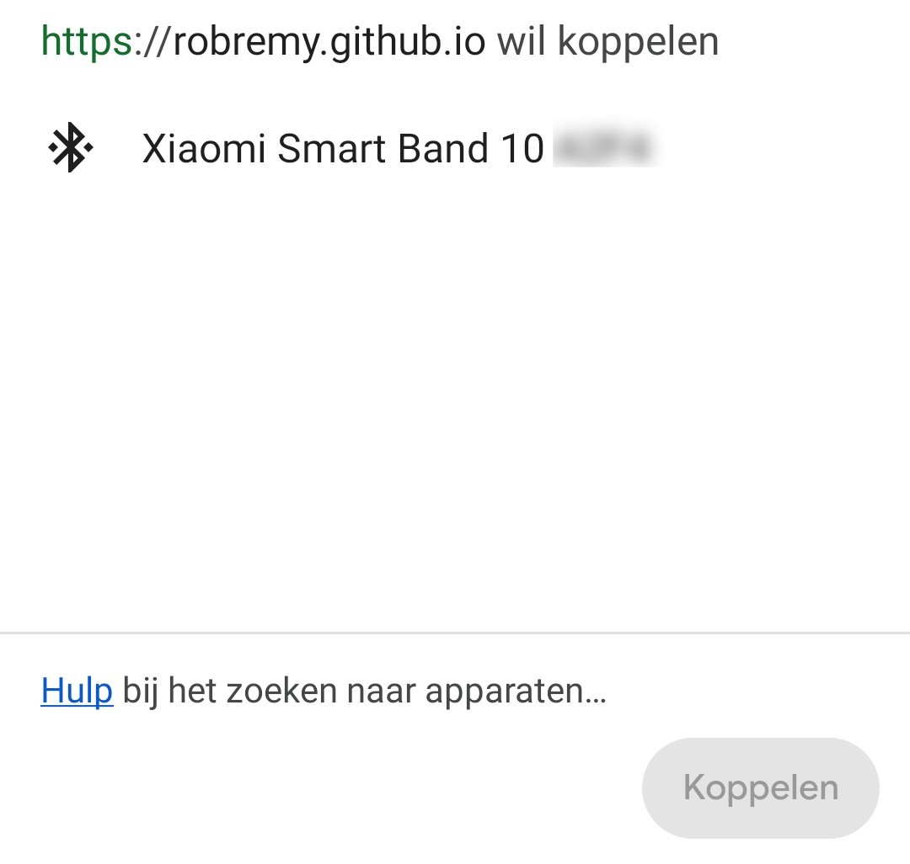

# Heart Rate Alert

## Screenshots

  
  
  

  
  
  

  
  
  

Heart Rate Alert functioneert offline in Chrome:

- Web Bluetooth
- middels IndexedDB lokale opslag van
  metingen
- CSV export

## Installatie 

- https://robremy.github.io/HBmonitor
  Chrome menu → Toevoegen aan startscherm → Installeren

## Xiaomi Band

Op de band:

Settings → Share HR → On

## Data

Alle hartslagmetingen blijven lokaal in Chrome IndexedDB op het apparaat.
Gebruik "Download CSV vandaag" om data te exporteren.

## Versie 2026.08.02-v29

- HrBridgeService.kt speelt in audio-modus nu exact dezelfde toon als de PWA: een gesynthetiseerde 950 Hz toon (500 ms aan / 250 ms stil, 5 keer herhaald) via AudioTrack, in plaats van het systeem-standaard alarmgeluid van het toestel. Kanaal-ID gewijzigd naar `hr_bridge_alarm_channel_v3` en het kanaal zelf is nu stil (geen kanaal-geluid/trillen meer) — geluid en trillen worden voortaan volledig programmatisch geregeld, zodat er niet twee dingen tegelijk afgaan.
- "Stop alarm" doet nu echt iets op de Android-service, niet alleen lokaal in de browser. De knop stuurt meteen (niet gedebounced) een `stopAlarmMs`-signaal naar de bridge via `/api/instellingen`; `HrBridgeService.kt` pollt tijdens een actief alarm elke 250ms op dit signaal (los van de gebruikelijke 15s-instellingenpoll) en breekt trillen/geluid direct af via `vibrator.cancel()` / `audioTrack.stop()`, en annuleert de alarmnotificatie.
- De knop stopt nu ook de browser-lokale audio-bliep-lus (voorheen liep die gewoon door tot het einde) en herstelt de kaartstijl (rode "alarm"-rand) direct, in plaats van te wachten tot de hartslag weer onder de grens zakt.

## Versie 2026.08.02-v28

- Bugfix: bij opstarten probeerde de PWA altijd zelf direct via Web Bluetooth met de band te verbinden (`autoConnectLastBandOnStartup`), ook als de altijd-actieve Android-bridge-service de band al vasthield. Dit gaf de misleidende melding "Band toestemming niet automatisch teruggevonden. Druk eenmaal op Opnieuw verbinden." — niet omdat de toestemming echt kwijt was, maar omdat de directe verbindingspoging altijd liep, ongeacht bridge-status, en om dezelfde BLE-verbindingsslot van de band concurreerde met de Android-service.
- `autoConnectLastBandOnStartup()` controleert nu eerst of de bridge bereikbaar is; zo ja, dan wordt de automatische directe verbinding overgeslagen en wordt vertrouwd op de bridge voor live data. Handmatig verbinden via de knop blijft altijd mogelijk.

## Versie 2026.08.02-v27

- Bugfix: het alarm van de altijd-actieve Android-achtergronddienst (HrBridgeService) trilde altijd, ook als de PWA op "Alarm: audio" stond. Twee oorzaken: (1) de gekozen modus werd nooit naar de bridge gestuurd (`pushInstellingenNaarBridge()` stuurde alleen limit/secondsHigh/cooldownSec), en (2) `HrBridgeService.kt` las de modus sowieso niet uit en had geen geluidsafspeel-logica — alleen trillen.
- De PWA stuurt de alarmmodus nu direct mee bij het wisselen van de knop (niet alleen bij wijzigen van de tekstvelden), en `HrBridgeService.kt` leest en respecteert deze modus, met een nieuwe `speelAlarmGeluid()`-functie die een Ringtone met `AudioAttributes(USAGE_ALARM)` afspeelt.
- Het alarmkanaal-ID is gewijzigd naar `hr_bridge_alarm_channel_v2` omdat een Android-notificatiekanaal na aanmaken onveranderlijk is qua geluidsinstelling; een kanaal dat ooit zonder geluid werd aangemaakt bleef dat voor altijd, ongeacht latere codewijzigingen.

## Versie 2026.08.02-v26

- Bugfix: bridge-sync (Termux hr_sync_server.py) haalde altijd alleen de metingen van vandaag op en sloeg ze nooit in IndexedDB op — alleen in het tijdelijke geheugen. Hierdoor ontbrak data in de grafiek van eerdere dagen zodra de pagina herlaadde of de kalenderdag omsloeg, ook als de metingen wel degelijk in de bridge-database (hbmonitor.db) stonden.
- `syncBridgeIntoToday()` is vervangen door de algemenere `syncBridgeData(dateKey)`, die voor elke zichtbare dag (vandaag + de 3 voorgaande) bridge-metingen ophaalt en permanent wegschrijft naar IndexedDB via `saveSampleIndexedDb()`, met dedup op basis van de meting-id.
- Het laden van de recente daggrafieken (`loadRecentDayCharts`) doet nu voor elke dag eerst een best-effort bridge-backfill vóór het lezen uit IndexedDB.

## Versie 2026.07.25-v25

- README bijgewerkt met een volledige set schermafbeeldingen: overzicht, ingezoomde grafiek, bediening, log, info toevoegen, annotatie-opties, gegevens exporteren/importeren, widget-info en Bluetooth-koppeling.

## Versie 2026.07.24-v23

- Elke daggrafiek toont nu dezelfde samenvatting als vandaag: metingen, laatste hartslag, aantal boven de alarmgrens, pieken met gemiddelde hersteltijd en plateaus.

- Plateauherkenning: perioden waarin de hartslag ≥90 sec binnen een smalle bandbreedte boven de 90 bpm blijft, worden geel gearceerd in de grafiek.
- Herstelbrackets: bij elke piek boven de persoonlijke baseline wordt een gestippelde verticale lijn met hersteltijd ("↓ X min") getekend tot de hartslag weer bij baseline is.
- De statusregel onder elke grafiek toont nu ook het aantal gedetecteerde pieken met gemiddelde hersteltijd en het aantal plateaus.

## Versie 2026.07.20-v20

- Tekst in de grafieklegenda gewijzigd van **boven alarmwaarde** naar **boven alarmgrens**.
- Een bestaande annotatie kan met een korte tik worden aangepast. Na het verslepen opent het bewerkingsvenster direct op de nieuwe positie.

- De losse knop **Annotatie opties** is verwijderd. Beheer van iconen en eigen teksten staat nu als **⚙️ Opties wijzigen…** onderaan de annotatielijst bij een grafiek.

- Pinch-zoom rond het aangeraakte tijdstip.
- Horizontaal schuiven met één vinger wanneer ingezoomd.
- Maximale zoom: 1024×.
- Lang indrukken en bewegen toont tijd, hartslag en grensstatus zoals een Grafana-tooltip.

- Vier hartslaggrafieken onder elkaar: vandaag en de drie voorgaande dagen.
- Automatisch opnieuw verbinden na een onverwachte Web Bluetooth-verbreking.
- Bij terugkeer uit het lock screen controleert de app direct de verbinding en probeert deze te herstellen.
- Handmatig verbreken start geen automatische reconnect.

- Detailvenster kan een activiteit of klacht aan een exact meetpunt koppelen; deze info wordt lokaal opgeslagen en meegenomen in CSV-export.

### Annotatie-opties
Via **⚙️ Opties wijzigen…** onderaan de annotatielijst kunnen de iconen en teksten worden gewijzigd. Eigen opties kunnen worden toegevoegd en bestaande opties verwijderd. De instellingen worden lokaal in de browser bewaard.
