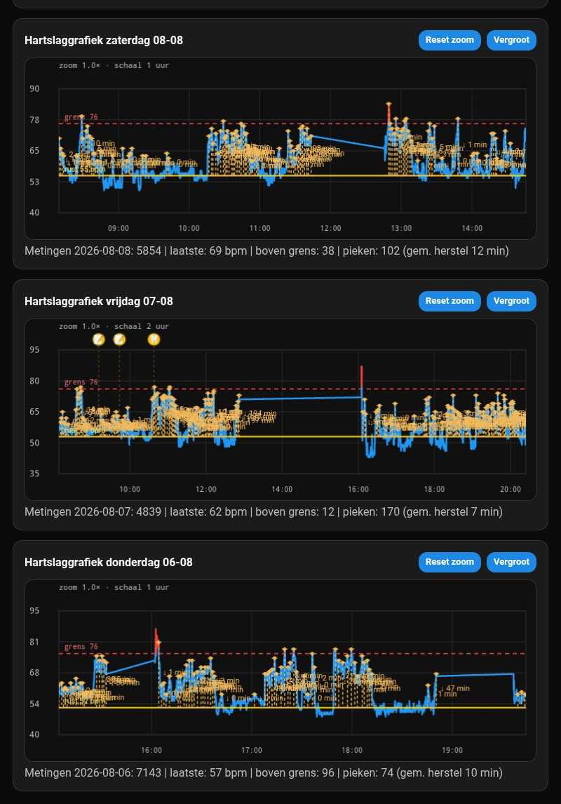

# Heart Rate Alert

## Screenshots

  

  

  

  

Heart Rate Alert works offline in Chrome:

- Web Bluetooth
- Local storage of measurements via IndexedDB
- CSV export

## Installation

- https://robremy.github.io/HBmonitor
  Chrome menu → Add to home screen → Install

## Xiaomi Band

On the band:

Settings → Share HR → On

## Data

Heartbeat data from the Xiaomi Smart Band 10 can now be read by another Android device via the Bridge function. This solves the disconnect issues in the PWA's (Heart Rate Alert) Web Bluetooth code. The PWA connects to the Bridge (`hr_sync_server.py`) by default.

### Bridge components

- **[robremy/HrBleBridge](https://github.com/robremy/HrBleBridge)** — Kotlin app that reads heartbeat data into a JSONL file
- Running in Termux:
  - **`hr_tail.py`** — Python script that reads the JSONL file into a SQLite database
  - **`hr_sync_server.py`** — Python script that syncs SQLite to the PWA's IndexedDB

## Version 2026.08.05-v39

- The bridge address is now configurable via an input field (`bridgeAddressInput`), stored in localStorage (`hbmonitor_bridge_address`). This lets the PWA on a SECOND phone point to the bridge on the FIRST phone via its LAN IP address instead of only `127.0.0.1:8787`. `checkBridgeAvailable()` also displays the bridge phone's own LAN IP (`bridgeOwnIp`) when `hr_sync_server.py` includes it in the `/api/health` response, so that address can easily be copied onto the second device. A button resets the address back to the default.
- The initial bridge-availability check on page load now retries with increasing delay (1.5s / 3s / 5s / 8s / 13s) instead of trying only once. Right after a pull-to-refresh, `127.0.0.1:8787` is sometimes briefly unreachable while Termux/the network is still starting up; without the retry, the page would permanently show "Bridge: unreachable" until "Sync with bridge" was tapped manually.
- New `syncMetBridgeKnop()` wrapper behind the "Sync with bridge" button: it now explicitly resets `selectedDateKey` to today (and hides the "back to today" button) before calling `loadRecentDayCharts()`. Previously, a still-selected older date in the date picker could cause the sync button to sync around that old day instead of today, resulting in an empty "today" chart and a live BPM reading that never updated.
- Recovery brackets (`findRecoveryBrackets`) now skip peaks that fall within a 2-minute settle window after a reconnect of ≥3 minutes (`isWithinReconnectSettleWindow`). This prevents a sensor power-on effect after a longer connection dropout from being mistaken for a real heart rate peak with an associated recovery period.
- Annotations on a measurement that came in via the bridge (`sample.source === "bridge"`) are now written to the bridge database (`postAnnotationToBridge`) instead of IndexedDB, so the Android bridge and the PWA see the same annotation regardless of which side added it.

## Version 2026.08.02-v32

- Critical bugfix in the v30 optimization: `bridge_ts` is an ISO datetime STRING (matching Android's `ts TEXT PRIMARY KEY`), not a number. The new-measurements filter compared this string directly against a numeric watermark (`s.bridge_ts > laatsteTs`), which JavaScript's type coercion always turned into `NaN`/`false`. As a result, after the very first sync on page load, `nieuweBridgeSamples` stayed permanently empty — no more IndexedDB writes, so the live reading (just added in v31) never received any data either.
- Fixed by comparing against `ts_ms` (already converted to a numeric epoch-millisecond value) instead of `bridge_ts` itself, both when filtering and when updating the watermark.

## Version 2026.08.02-v31

- Bugfix: the live heart rate reading ("Heart rate: -- bpm") and the contact field were only updated from `onHeartRate()`, the direct Web Bluetooth callback. With bridge-only use (no direct BLE connection from the browser, only via the Android bridge service), that function was never called, so the live reading stayed permanently at "--", even though the chart and storage were updating normally.
- `syncBridgeData()` now also updates `#liveHeartRate` and `#contact` from the most recently received bridge measurement (only if it's actually more recent than what was already known, so a slow bridge sync never overwrites a fresh direct BLE reading), and updates `lastHeartRateAt` so the "no recent data" detection also stays correct in bridge-only use.

## Version 2026.08.02-v30

- Chart auto-refresh via the bridge is now 5s instead of 30s, for a more real-time view without the Android service and the PWA competing for the same BLE connection to the band.
- To make this feasible with a growing number of daily measurements: `syncBridgeData()` now writes only the measurements not already saved this session (tracked per day) to IndexedDB per sync cycle, instead of rewriting the entire day on every cycle. The bridge server itself still returns the whole day on each call (no "since" filter available); only the IndexedDB write step is now incremental.
- Note: an annotation added after the fact to an already-synced (older) measurement now only comes through after a full page reload due to this optimization, not within the same session.

## Version 2026.08.02-v29

- In audio mode, HrBridgeService.kt now plays exactly the same tone as the PWA: a synthesized 950 Hz tone (500ms on / 250ms off, repeated 5 times) via AudioTrack, instead of the device's default system alarm sound. Channel ID changed to `hr_bridge_alarm_channel_v3` and the channel itself is now silent (no more channel sound/vibration) — sound and vibration are now handled entirely programmatically, so two things no longer go off at once.
- "Stop alarm" now actually does something on the Android service, not just locally in the browser. The button immediately (not debounced) sends a `stopAlarmMs` signal to the bridge via `/api/instellingen`; `HrBridgeService.kt` polls for this signal every 250ms during an active alarm (separate from the usual 15s settings poll) and immediately stops vibration/sound via `vibrator.cancel()` / `audioTrack.stop()`, and cancels the alarm notification.
- The button now also stops the browser-local audio beep loop (previously it just kept running to the end) and restores the card style (red "alarm" border) immediately, instead of waiting for the heart rate to drop back below the threshold.

## Version 2026.08.02-v28

- Bugfix: on startup, the PWA always tried to connect directly to the band via Web Bluetooth itself (`autoConnectLastBandOnStartup`), even when the always-on Android bridge service already held the band connection. This produced the misleading message "Band permission not automatically restored. Press Reconnect once." — not because permission was actually lost, but because the direct connection attempt always ran regardless of bridge status, competing with the Android service for the same BLE connection slot on the band.
- `autoConnectLastBandOnStartup()` now first checks whether the bridge is reachable; if so, the automatic direct connection is skipped and the bridge is relied on for live data. Manual connection via the button remains always available.

## Version 2026.08.02-v27

- Bugfix: the alarm on the always-on Android background service (HrBridgeService) always vibrated, even when the PWA was set to "Alarm: audio". Two causes: (1) the chosen mode was never sent to the bridge (`pushInstellingenNaarBridge()` only sent limit/secondsHigh/cooldownSec), and (2) `HrBridgeService.kt` didn't read the mode at all and had no sound-playback logic — only vibration.
- The PWA now sends the alarm mode immediately when the button is toggled (not only when the text fields change), and `HrBridgeService.kt` reads and respects this mode, with a new `speelAlarmGeluid()` function that plays a Ringtone with `AudioAttributes(USAGE_ALARM)`.
- The alarm channel ID changed to `hr_bridge_alarm_channel_v2` because an Android notification channel's sound setting is immutable after creation; a channel that was once created without sound stayed that way forever, regardless of later code changes.

## Version 2026.08.02-v26

- Bugfix: bridge sync (Termux hr_sync_server.py) always fetched only today's measurements and never saved them to IndexedDB — only to temporary memory. As a result, data for earlier days was missing from the chart as soon as the page reloaded or the calendar day rolled over, even though the measurements were indeed present in the bridge database (hbmonitor.db).
- `syncBridgeIntoToday()` has been replaced by the more general `syncBridgeData(dateKey)`, which fetches bridge measurements for each visible day (today + the 3 preceding days) and permanently writes them to IndexedDB via `saveSampleIndexedDb()`, with dedup based on the measurement ID.
- Loading the recent day charts (`loadRecentDayCharts`) now does a best-effort bridge backfill for each day before reading from IndexedDB.

## Version 2026.07.25-v25

- README updated with a complete set of screenshots: overview, zoomed chart, controls, log, adding info, annotation options, exporting/importing data, widget info, and Bluetooth pairing.

## Version 2026.07.24-v23

- Every day chart now shows the same summary as today: measurements, latest heart rate, count above the alarm threshold, peaks with average recovery time, and plateaus.

- Plateau detection: periods where heart rate stays ≥90 sec within a narrow band above 90 bpm are highlighted in yellow on the chart.
- Recovery brackets: for each peak above the personal baseline, a dotted vertical line with recovery time ("↓ X min") is drawn until the heart rate returns to baseline.
- The status line under each chart now also shows the number of detected peaks with average recovery time and the number of plateaus.

## Version 2026.07.20-v20

- Chart legend text changed from **above alarm value** to **above alarm threshold**.
- An existing annotation can be edited with a short tap. After dragging, the edit window opens directly at the new position.

- The standalone **Annotation options** button has been removed. Managing icons and custom text is now under **⚙️ Change options…** at the bottom of the annotation list on a chart.

- Pinch-zoom around the touched time point.
- Horizontal scroll with one finger when zoomed in.
- Maximum zoom: 1024×.
- Long-press and drag shows time, heart rate, and threshold status like a Grafana tooltip.

- Four heart rate charts stacked vertically: today and the three preceding days.
- Automatic reconnect after an unexpected Web Bluetooth disconnection.
- On returning from the lock screen, the app immediately checks the connection and tries to restore it.
- Manually disconnecting does not start an automatic reconnect.

- The detail window can link an activity or complaint to an exact measurement point; this info is stored locally and included in the CSV export.

### Annotation options
Via **⚙️ Change options…** at the bottom of the annotation list, icons and text can be changed. Custom options can be added and existing options removed. Settings are stored locally in the browser.
