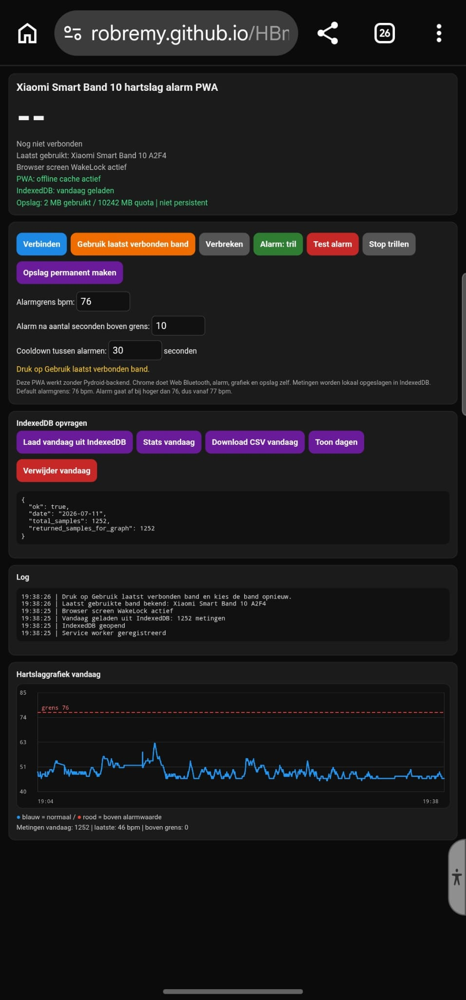

# Xiaomi Smart Band 10 Heart Rate Alarm PWA

## Screenshot

  

Deze app is een statische PWA:

- Geen Pydroid3-backend nodig tijdens gebruik
- Geen SQLite-server nodig
- Chrome doet Web Bluetooth
- Chrome bewaart metingen lokaal in IndexedDB
- CSV export gebeurt in Chrome
- App kan offline werken na installatie via Service Worker

## Publiceren via GitHub Pages

1. Push deze bestanden naar een GitHub repository.
2. Ga in GitHub naar:
   Settings → Pages
3. Kies:
   Source: Deploy from a branch
   Branch: main
   Folder: /root
4. Klik Save.
5. Open de GitHub Pages URL in Chrome Android.
6. Chrome menu → App installeren of Toevoegen aan startscherm.

## Belangrijk

Web Bluetooth werkt alleen op secure origins:

- HTTPS, zoals GitHub Pages
- localhost / 127.0.0.1 tijdens testen

Open de app dus niet via een gewone file:// URL.

## Xiaomi Band

Op de band:

Settings → Share HR → On

Sluit nRF Connect af voordat je deze app gebruikt, anders kan de BLE-verbinding bezet zijn.

## Data

Alle hartslagmetingen blijven lokaal in Chrome IndexedDB op het apparaat.
Gebruik "Download CSV vandaag" om data te exporteren.
